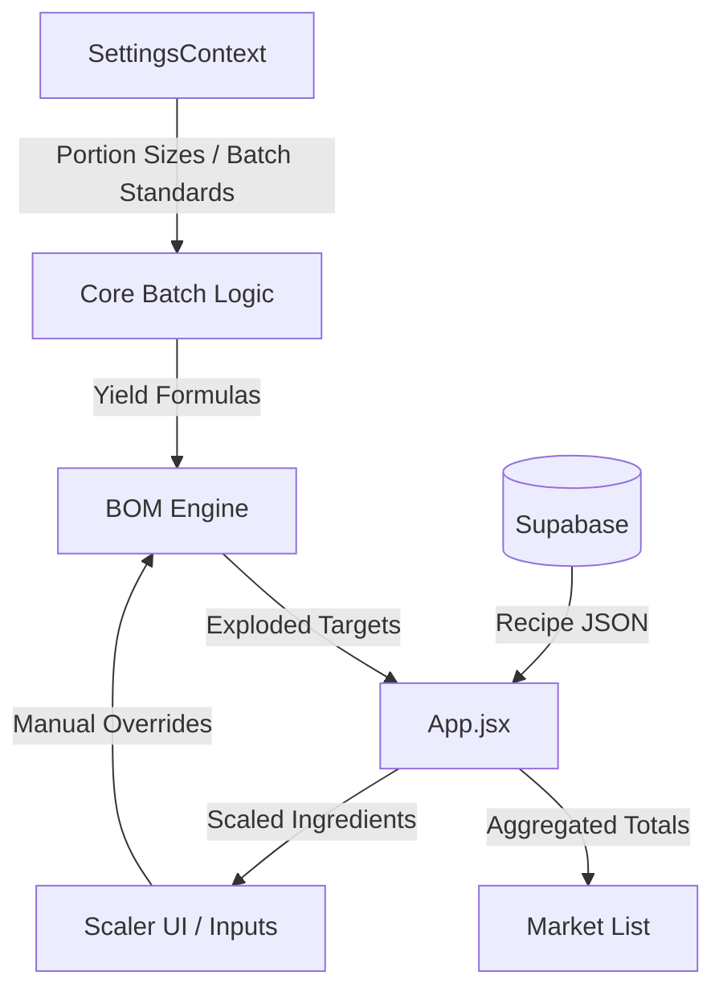

# SOP App Architecture: Core Logic & Scaling Strategy

## A. Purpose
The Kabile SOP App is a high-density operational tool designed for professional kitchens. It handles multi-tier recipe scaling, Bill of Materials (BOM) explosion, and market order aggregation with "Chef's Grade" precision. It prioritizes deterministic yields and standardized portioning over simple mathematical scaling.

## B. Data Flow Diagram

## C. Core Entities
- **Recipe**: The base template containing `baseYield`, `unit`, and `ingredients`.
- **Ingredient**: Components of a recipe, which can be "Leaf" (raw items) or "Sub-recipes" (linked via SKU).
- **dailyProduction**: A state map containing user-defined manual overrides for specific recipe yields.
- **standardBatchYield**: The "Gold Standard" yield for 1 production run of a recipe (e.g., 50 portions or 20kg).

## D. Business Rules
- **Reactivity Priority**: Manual overrides (`seeds`) in the BOM Engine take precedence. If no override exists, the engine defaults to calculating based on `volumeFocus` (Daily Volume Focus slider).
- **Metric Auto-scaling**: Quantities ≥ 1000g/ml are automatically converted to kg/L for chef readability.
- **Chef Rounding**: Quantities are rounded to professional kitchen increments (e.g., nearest 5g, 10g, or 50g) to ensure prep accuracy.
- **BOM Explosion**: Changes in a parent recipe (main dish) cascade down to all children (prep items, sauces) recursively.

## E. Source of Truth Locations
| Rule / Logic | File Location | Primary Function |
| :--- | :--- | :--- |
| **BOM Explosion** | [BOMEngine.js](file:///Users/teo/Documents/N8N_VSCODE/cabij_sop_app/src/utils/BOMEngine.js) | `calculateBOM()` |
| **Portion Weighing** | [batch.js](file:///Users/teo/Documents/N8N_VSCODE/cabij_sop_app/src/core/batch.js) | `getPortionWeight()` |
| **Batch Standards** | [batch.js](file:///Users/teo/Documents/N8N_VSCODE/cabij_sop_app/src/core/batch.js) | `getStandardBatchYield()` |
| **Rounding Logic** | [units.js](file:///Users/teo/Documents/N8N_VSCODE/cabij_sop_app/src/core/units.js) | `chefRound()` |
| **Unit Formatting** | [quantities.js](file:///Users/teo/Documents/N8N_VSCODE/cabij_sop_app/src/core/quantities.js) | `formatQuantity()` |
| **SKU Mapping** | [sku.js](file:///Users/teo/Documents/N8N_VSCODE/cabij_sop_app/src/core/sku.js) | `resolveRecipeIdBySku()` |

## F. Anti-patterns
- **Never** perform raw math `(qty * factor)` directly in React components. Always use `formatQuantity` or `formatDisplay`.
- **Never** hardcode batch sizes (like 50) in UI buttons. Always use `getStandardBatchYield(recipe)`.
- **Avoid** local state for quantities that affect other recipes. Use the central `dailyProduction` map.

## G. Testing Strategy
- **Build Checks**: `npm run build` must pass before any commit.
- **Manual Verification**: Test scaling against "Master Rules" in the settings page.

## H. Change Protocol
1. Create a plan in `workflows/plans/`.
2. Implement changes in `src/core/` first if they affect logic.
3. Update `App.jsx` to reflect core changes.
4. Run `npm run build`.
5. Verify on Scaler UI.
